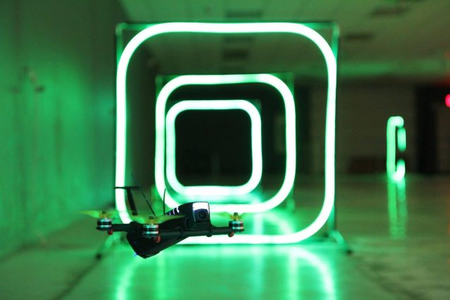

# DroneSpace Pi Gates

This is a code repository which contains the code to drive the FPV drone gates at DroneSpace (now closed). This code leverages communication between gate nodes and a master web application. Gate colors and animations are synced across a local network. 

